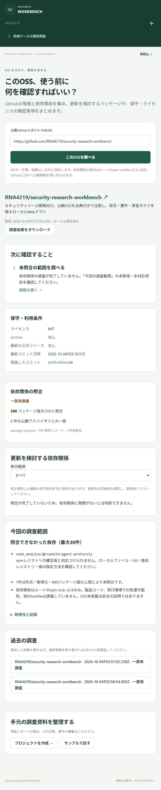

# Security Research Workbench

**調査で得た製品知識と人の判断を次回にも使い、確認事項を修正・確認まで追えるワークベンチを目指しています。** 同じ説明や判定のやり直しを減らすことが、製品全体の目的です。

現在公開しているのは、その入口となるOSS採用前調査です。使いたいOSSのGitHub URLを入れると、保守状況・依存関係・既知の問題を調べ、「採用する前に何を確認すべきか」を返します。

[ブラウザで使う →](https://rna4219.com/open/security-research-workbench/) · [公開ツール一覧](https://rna4219.com/open/)

Horos・Ergon・まとめ編から取り込む要求は[要求・要件定義v3](docs/requirements.md)と[記事との対応表](docs/logos-traceability.md)に明記しています。目的別知識の更新、工程の再開、判断の再利用、モデル交換、修正確認の追加要件FR-17〜31は**未実装・受入未完了**です。公開版や既存テストの成功で、これらまで完成したとは扱いません。

導入候補を見つけたとき、GitHubの更新履歴、ライセンス、ロックファイル、脆弱性情報を一つずつ開いて転記する作業を引き受けます。資料や比較表を先に手入力する必要はありません。

| あなたがすること | アプリがすること | 返ってくるもの |
|---|---|---|
| 公開GitHub URLを入力して「このOSSを調べる」を押す | GitHubから保守情報と対象コミットのnpm lockfileを取得し、依存名・確定版をOSVと照合 | 採用前の確認事項、更新を検討する依存版と公開された修正境界、出典、未調査範囲 |

例えば、依存パッケージの版が公開アドバイザリと一致したら、その名前・版・ロックファイル内の場所・修正境界を並べます。archiveされていれば後継版や保守方法の確認を促し、ライセンスが識別できなければ利用条件の確認事項を出します。**取得できなかった情報は未確認として残します。**

結果は日時・コミット・出典付きで自動保存されます。「過去の調査」から再表示でき、Markdownとして持ち出せます。ChatGPTへの貼り付けやAPIキーは不要です。

<details>
<summary>実際の調査画面を見る</summary>



</details>

依存関係の照合は、現在**ルートの `npm-shrinkwrap.json` / `package-lock.json`（v2/3）**に対応しています。保守情報は言語を問いません。製品コードの問題、実行環境での影響、他の言語やサブディレクトリの依存関係は調査しません。採用の可否は、用途との適合と調査できなかった範囲も含めて判断してください。

## まず触ってみる

[公開版](https://rna4219.com/open/security-research-workbench/)を開き、公開GitHub URLを入力してください。インストール・APIキーは不要です。調査処理はブラウザで実行し、GitHubとOSVへ直接問い合わせます。履歴はこのブラウザに最新20件・合計2 MiBまで保存します。端末間の同期はありません。残したい結果はMarkdownでダウンロードしてください。

公開版はURLからのOSS調査に対応しています。資料の整理・比較・要件レビューも利用する場合は、次のローカル版を使います。

### ローカル版

Node.js 24を用意し、リポジトリで次を実行します。

```sh
npm ci
npm run build
npm start
```

1. http://127.0.0.1:4317 を開く。
2. 調べたい公開リポジトリのURLを入力して、**「このOSSを調べる」**を押す。
3. 「次に確認すること」と「更新を検討する依存関係」を読む。未取得の項目は「今回の調査範囲」で確認する。

試すURLには、このリポジトリ `https://github.com/RNA4219/security-research-workbench` も使えます。結果は取得時点の公開情報によって変わります。

調査は最大45秒を目安に制限し、APIの利用制限や失敗を画面に表示します。GitHub認証は使わず、公開情報だけを取得します。OSVへ送るのは公開lockfileから抽出した依存名と版です。最大400パッケージ版を照合し、上限に達した場合は未調査範囲を表示します。

保存先はローカルの `.data/` で、Gitには含まれません。既存の資料取込・手動比較・要件レビューは、下部の「手元の調査資料を整理する」と左のプロジェクト一覧から使えます。そちらの「サンプルで試す」は、未レビューの手動比較例を作成する機能です。

## 運用と詳しい仕様

Windowsでターミナルを閉じても使い続ける場合は、ビルド後にPowerShellで次を実行します。起動したシェルの終了後もバックグラウンドで動きます。PC再起動後は再びstartを実行してください。

```powershell
./scripts/local-server.ps1 start
./scripts/local-server.ps1 status
# 使用後に停止
./scripts/local-server.ps1 stop
```

この起動方法はポート4317とリポジトリ内の`.data/workbench.db`を使用します。ログとプロセス情報は`.cache/runtime/`に保存されます。接続エラー時はstatusで状態を確認し、停止していればstartを実行します。プロセスのID・起動時刻・実行ファイル・引数が一致する場合のみ、stopが停止を行います。

JSONの形式、レビュー状態、任意のagent-protocols・memx連携は以下の文書で説明します。個別CVEのOSV・CISA KEV・FIRST EPSS照会も、既存プロジェクトから利用できます。

## ドキュメント

- [URLからの調査仕様・対象範囲・テスト設計](docs/repository-research.md)
- [GitHub Pages版の構成・公開・検証](docs/pages.md)
- [自動調査の実測・検証結果](docs/testing/2026-10-04-repository-research.md)
- [要求・要件定義v3](docs/requirements.md)
- [Logos 3記事との対応・現在の不足](docs/logos-traceability.md)
- [追加要件の受入計画・未実行ケース](docs/manual-bb/logos-plan.md)
- [調査と設計判断](docs/research.md)
- [公開脆弱性知識の出典と読み方](docs/vulnerability-knowledge.md)
- [公開脆弱性知識の手動検証](docs/manual-bb/vulnerability-results.md)
- [APIとデータ形式](docs/interfaces.md)
- [検証記録](docs/acceptance.md)
- [テスト拡充とカバレッジ](docs/testing/2026-10-04-coverage.md)
- [最終検証・QEG Go判定](docs/testing/2026-10-04-final-gate.md)
- [依存OSS・再ビルド](THIRD_PARTY_NOTICES.md)

## 開発コマンド

`npm run check` で型検査・テスト・ビルド、`npm run test:e2e` でブラウザテストを実行します。
ブラウザテスト前に `npx playwright install chromium` を実行してください。

`npm run test:quality` は単体・APIとブラウザーのカバレッジを統合し、全体の行・文・関数・分岐90%、ファイル別の行90%・分岐85%、変更行90%を下回ると失敗します。変更行の基準コミットを参照するため、shallow cloneでは先に`git fetch --unshallow`を実行してください。
結果は`.cache/coverage-combined/index.html`、`gate.json`、`lcov.info`、実行対象のハッシュ付き`run-identity.json`、`.cache/quality/*junit.xml`に保存されます。画面の計測用ビルドは`.cache/coverage-build`、一時DBと待受はテスト専用の4318番を使用します。通常の製品ビルドには計測を含めません。
テスト設計の範囲は[継続回帰テスト計画](docs/testing-plan.md)を参照してください。CIで同じカバレッジ条件と通常ビルドのブラウザーテストを実行し、レポートをartifactとして保存します。

## memx-resolver

任意連携です。ローカルで専用のresolverストアを起動し、`MEMX_URL=http://127.0.0.1:7766` を設定して本アプリを起動します。
画面から資料同期、検索、参照、鮮度確認を操作できます。未接続でも基本機能は利用可能です。

## 任意アダプターと旧版データ

agent-protocolsはoptionalDependenciesです。通常の`npm ci`では固定版を導入し、出力操作時だけ読み込みます。ビルド後に`npm ci --omit=dev --omit=optional --ignore-scripts`を行うと、アダプターなしの実行環境になります。`npm start`で基本機能を利用でき、内部タスク契約の出力に外部OSSは不要です。開発ビルドにはVite等のプラットフォーム依存パッケージが必要なため、通常の`npm ci`を使用してください。

旧DB（user_version=1）は起動時に版2へトランザクション内で移行します。既存のスナップショットと原文を保持し、旧出典参照は未検証のEvidence/Claimへ変換します。旧承認は再レビューが必要です。更新前にアプリを停止して`.data/`をバックアップしてください。旧バイナリは新版DBを開けません。

## 対象外

コードの静的解析、攻撃・脆弱性再現、AI API課金、ワーカー自動実行、ホスティング、複数ユーザー認証は含めません。
TaskSeedはドラフトとして出力し、実行は利用者の既存ワークフローに委ねます。
