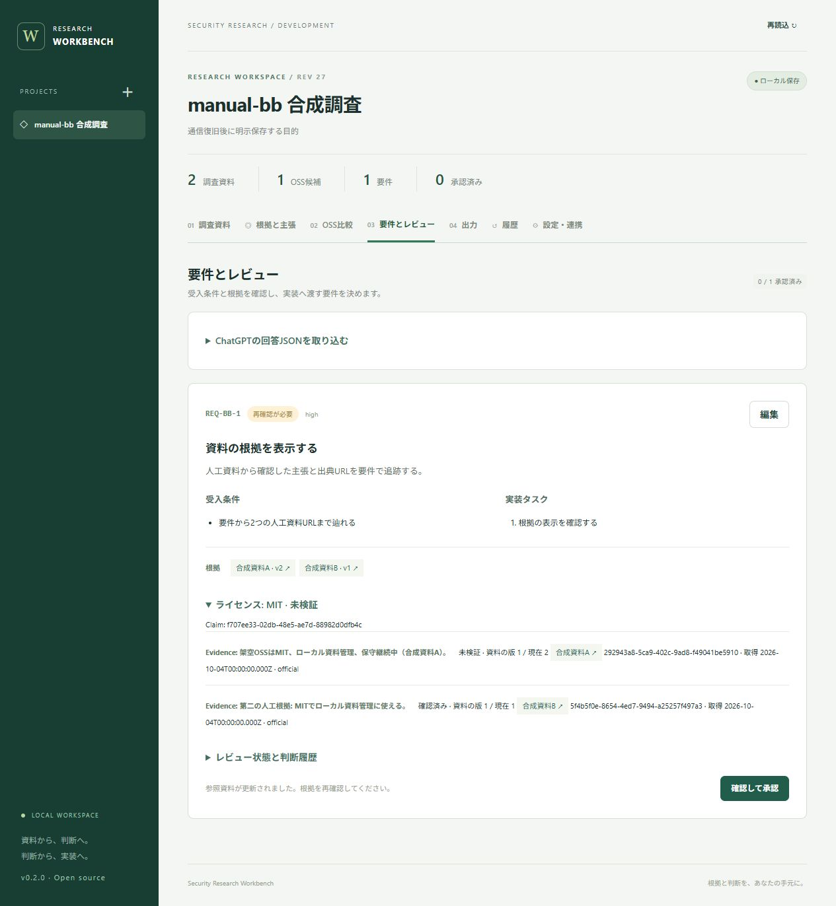

# manual-bb 実行結果（2026-10-04）

事前に[テスト設計](2026-10-04-plan.md)を保存してから、Codexアプリ内ブラウザの画面で実施した。**手動12ケース、単体/API 23件、E2E 5件はすべて合格**。重大な機能不具合は観測していない。正式なstandard Gateは **no_go（変更箇所の自動カバレッジが75%未満）**。

- run_id: `MANUAL-BB-20261004-01`、tester: Codex、primary_view: black。
- 対象: `c8da809e08aed4f40125d201ebf870603937ef3d`。実行後にバージョン表記1行を修正し、その表示を再確認。
- 計画SHA256: `848f13c0daa8d444e85c5f1e912bfd83a0132903a28b2805c2146f06652b7b1a`。
- 環境: Windows / Node.js 24 / production build / Codexアプリ内ブラウザ、専用 `127.0.0.1:4320`、人工データのみ。連携障害試験は別の空DBと `127.0.0.1:4321` で実施。
- 通常利用の4317と既存DBは試験対象外。停止操作は専用DBのサーバーだけで実施。
- 後始末: 試験用4320/4321を停止。通常利用の4317はhealthz=ok、既存プロジェクトは試験前と同じ1件・REV7。人工データのDBと詳細な観測ログはローカルcacheに保持。
- source_refs: 設計のSPEC/API/MODEL/BUG-FETCH/CI/OPS。assumptions: 設計のASM-1〜3を維持。confidence: high（直接観測した結果）、medium（未実施範囲を含むリリース判断）。

## 1. 根拠付き観点

O1〜O9の全観点に対して直接観測を得た。境界値、拒否経路、承認の状態遷移、資料更新、競合、通信断と復旧を実行した。未設定memxはUI操作が非表示のため、その表示とAPI503を確認し、別の空DBでは停止中のローカル連携先を設定して「資料を同期」による障害表示と保存状態不変を確認した。

旧DB移行、optionalパッケージ不在、ブラウザ横断互換性、100万文字/2MiB境界は今回の手動実施範囲に含めていない。関連する既存自動証跡を手動合格件数に加算していない。

## 2. リスク・不具合

| ID | 結果・残存リスク | source_refs / basis |
|---|---|---|
| R1 | 根拠不足・比較未承認・資料不足・資料更新による失効が期待どおり。古い契約の出力ボタンも無効 | TC-03〜09、SPEC FR-11〜15 |
| R2 | 競合を拒否。通信断中の入力保持、自動再送なし、明示再保存、再起動後の復元を確認 | TC-10〜12、BUG-FETCH、API |
| R3 | 不正JSON/重複IDを拒否し、原文と既存要件を保持 | TC-06、SPEC FR-06 |
| R4 | 根拠の双方向参照、レビュー理由・日時・revisionを確認 | TC-03/04/07/08、SPEC FR-11/12/15 |
| R5 | 1〜200文字の境界と重複資料処理を確認 | TC-01/02、MODEL、SPEC FR-01〜03 |
| R6 | 未設定表示、API503、状態不変を確認。別の空DBでも設定済み連携先への通信失敗を画面操作で確認し、再読込後の資料数2・REV2不変を確認 | TC-09、API、実行制約B1の解消記録 |
| D1 | **low・修正済み**: UIがv0.1.0と表示していた。package.jsonのv0.2.0に合わせ、再ビルド後の実画面で確認 | 初期画面、`src/client/main.tsx`、再確認画像 |

## 3. 優先度と集計

| 優先度 | 完全合格 | 部分実施 | 失敗 |
|---|---:|---:|---:|
| P0 | 6 / 6 | 0 | 0 |
| P1 | 4 / 4 | 0 | 0 |
| P3 | 2 / 2 | 0 | 0 |
| 合計 | 12 / 12 | 0 | 0 |

TC-09は初回の部分実施から追加試験後に合格へ更新した。独立した3人/3モデルによる実行はしていない。

## 4. 手動ケースの期待結果と実結果

oracle.typeは全てspecified。source_refsは事前設計の参照ID。証跡名はローカル `.cache/manual-bb-20261004/` 内のファイルを示す。このフォルダとテストDBはGit対象外。公開する画像は人工データの画面だけを別途同梱する。

| ケース | expectedの要点 / oracle.refs | actual | 判定 / 証跡 |
|---|---|---|---|
| TC-01 | 必須空/201文字拒否、1/2/199/200保存、再読込保持 / MODEL, FR-01 | 空はブラウザ必須入力案内。1文字で作成、2/199/200でREV 2/3/4。201はtitle位置付きエラーでREV不変。名称を戻し再読込して復元 | pass / `tc01-boundaries.json`、TC-02画面REV5 |
| TC-02 | 資料2件の重複なし、URL検証、版/hash / FR-02/03, API | JSON再取込後も2件。not-a-urlはURL入力案内。訂正後成功。出典ID・URL・取得日・版・SHA256を表示 | pass / `tc02.txt`、`sources.json` |
| TC-03 | 根拠なしverified拒否、2Evidence紐付け / FR-11/13, API | 「確認済みの主張には…確認済みEvidenceが必要です」で拒否。A/Bを選び確認済みへ設定後に保存。Evidence選択変更は主張を未検証へ戻すため再確認して保存 | pass / `tc03-no-evidence-rejected.txt`、`tc03-multiple-verified.txt` |
| TC-04 | 3値を区別、条件不足の承認拒否、条件充足で承認 / FR-12/13, API | known→unknown（REV15）→empty（REV16）→knownを実行。未検証承認は拒否、検証後REV18で比較承認 | pass / `tc04-*.txt` |
| TC-05 | 未承認/必要資料欠落は生成拒否、全選択で生成 / FR-05/13, API | それぞれ日本語で理由を表示。A/B全選択で比較・Claim・2資料・回答Schemaを含むプロンプト生成 | pass / `tc05-*.txt`、`prompt.txt` |
| TC-06 | 不正/重複拒否、正常draft、原文保持 / FR-06, API | `{invalid`拒否。REQ-BB-1だけREV19でdraft取込。同じIDは既存IDエラー、件数1。履歴画面に不正回答原文を確認 | pass / `tc06-*.txt` |
| TC-07 | 判断状態・理由・日時・revision、根拠双方向追跡 / FR-07/11/15, API | 根拠不足→修正要求→却下→未レビュー→承認をREV20〜24に記録。ClaimからA/B、各EvidenceからREQ-BB-1を表示。needs_reviewはTC-08で確認 | pass / `tc07-review-states.json`、`tc07-reverse-refs.txt`、承認画像 |
| TC-08 | 資料更新で関連承認失効、旧版保持、再承認拒否 / FR-03/15, API | Aをv2に更新してREV25。A Evidenceは資料revision1/現在2で未検証、Bは確認済みのまま、関連Claimは未検証。比較/要件needs_review。再承認は根拠不足で拒否。REV24の旧状態も履歴で表示 | pass / `tc08-*.txt`、再確認画像 |
| TC-09 | 4形式の出力、失効契約の禁止、連携障害で状態保持 / FR-08/09/14, API | 画面から4形式をDownloadsへ保存。JSON=REV24/schema2.0、独立契約=REV24/1要件/2Evidence/2sourceRefs、Markdown両URL、adapter JSONも確認。更新後の契約ボタン無効。memx未設定表示、API503の前後REV27不変。別DBの「資料を同期」で日本語の接続失敗案内、再読込後も資料2件・REV2を保持 | **pass（追加試験完了）** / `workbench-*.json/md`、`tc09-*.txt`、gray補助記録、連携障害画像 |
| TC-10 | 古いタブの更新拒否、先行保存保持 / NFR, API | AがREV26で更新、Bは「別の画面で更新されました」。B再読込でAの目的を復元 | pass / `tc10-a-saved.txt`、`tc10-conflict.txt` |
| TC-11 | 接続案内・入力保持、自動再送なし、明示再保存1回 / BUG-FETCH, FR-01, OPS | 専用サーバー停止後、保存で日本語の再起動案内。入力は保持。復旧後Bタブには旧保存値が残り、Aの未保存入力も保持。明示保存でREV26→27。4317は継続稼働 | pass / `tc11-*.txt`、通信断画像 |
| TC-12 | 再起動/再読込後の保存値と旧履歴復元 / FR-01/15, API | 再起動直後REV26と旧保存値をBタブで確認。明示保存後再読込でREV27、REV1の「あ」と当初データを履歴表示。grayのDB集計でも再起動直後26版を保持 | pass / `tc12-*.txt`、TC-11補助記録 |

ダウンロードイベント待機APIがタイムアウトしたが、実際の4ファイルはDownloadsに生成されていた。画面操作によるダウンロードと保存ファイルの読取りで判定した。イベント待機の失敗だけを製品不具合には分類していない。

### 画面証跡

[承認済み要件から2つのEvidenceとURLを追跡](evidence/approved-provenance.jpg)、[通信断時の入力保持と日本語案内](evidence/disconnected.jpg)、[連携失敗時もREV2と資料2件を保持](evidence/memx-failure.jpg)。

## 5. 工数

- 見積り: 準備15分、実行65分、証跡10分、再試行20分=110分。
- 実績: 準備約5分、主な画面実行・証跡採取・表記修正の再確認は02:00〜02:14 JSTの約14分。追加の連携障害UI・coverage計測・E2E再実行は02:18〜02:24 JSTの約6分。最終報告作成は別枠。
- UIの定型入力をまとめて行ったため見積りより短縮。待機失敗の復旧時間を含む。同じ入力を複数回実行しただけで独立検証数を増やしていない。

## 6. Gate判定

- profile: **standard**、decision: **no_go（変更箇所の自動カバレッジが基準未達、リリース承認は保留）**。
- 自動証跡: 表記修正後、`npm run check` と `npm run test:e2e` が成功。型検査、23単体/API、production build、5E2E。既存c8da809の[CI](https://github.com/RNA4219/security-research-workbench/actions/runs/37138255013)はoptional省略構成も成功。
- 変更コードcoverage>=75%: **64.94%（226/348、単体/API実行のみ）で未達**。v0.1の`0d2faba8cc356f5c96f2bc28b316b95d2527cd8d`から追加・変更したsrc内の計測可能な文開始行を集計。PowerShell/CSS等は対象外。E2E・手動操作の実行量は合算していない。[差分集計](evidence/changed-coverage.json)。
- 全体の単体/API行coverageは52.64%（438/832）、serverは85.44%。React画面の実行は手動/E2Eで確認済みだが、そのcoverageはこの計測に含まれない。[計測結果](evidence/coverage-summary.json)。
- P0: 6/6完全合格。P1: 4/4完全合格=100%。高リスク観点も全て実行。
- 新規blocker/high defect: 観測0。lowのD1は修正・再確認済み。
- 残存: 自動coverageの基準未達。技術作業のownerは本リポジトリ保守担当/Codex、次回リリースGate前に画面coverageを含めた計測・不足経路の確認が必要。今回のテスト実行の許可を、coverage基準の免除とは扱わない。waivers: **なし**。

6条件の評価: 仕様充足=ok、追跡性=ok、自動証跡=degraded（coverage基準未達）、手動結果=ok、未修正不具合=観測0、残存リスク受容=なし。

再計測コマンドは `npm run test:coverage`。V8 providerを既存Vitestと同じ5.0.3で固定し、結果はGit対象外の `.cache/coverage/` に保存する。

### 実行制約 B1（解消済み）

未設定memxでは画面の操作ボタン自体が表示されない。補助API試験で503と保存状態不変を確認した。その後、既存テストサーバーを停止・再設定する複合コマンドは自動承認審査で拒否された（理由は `blocked by policy` のみ）。利用者の継続指示後も同じ方式は拒否されたため、既存プロセスを変更せず、別ポート4321・別の空DBを持つ独立した試験プロセスを起動した。この方法で、連携先を停止中の127.0.0.1:17767に設定し、合成資料の同期操作→エラー表示→再読込で保存状態不変を確認できた。追加試験は完了しており、B1は現在の阻害要因ではない。

## 7. Go/No-Go brief

- 機能: 根拠に基づく比較・要件レビュー、出力、ローカル保存と復旧。
- 結果: **手動12/12合格、自動23/23合格、E2E 5/5合格**。機能不具合の未修正0、表記不整合1件を修正。
- 判断: **No-Go（自動coverage条件未達）**。計画した手動ケースの実行は完了。
- 最上位リスク: 古い承認の流用、保存喪失、連携失敗の波及は手動試験で期待どおり。
- 次回リリースGateに必要な作業: 画面coverageも計測し、不足する自動検証経路を補って75%以上か再判定する。waiverによる省略は行っていない。

根拠付き観点→リスク→優先度→ケース→工数→Gate→briefの順で、manual-bb-test-harnessの成果物契約に沿って記録した。
