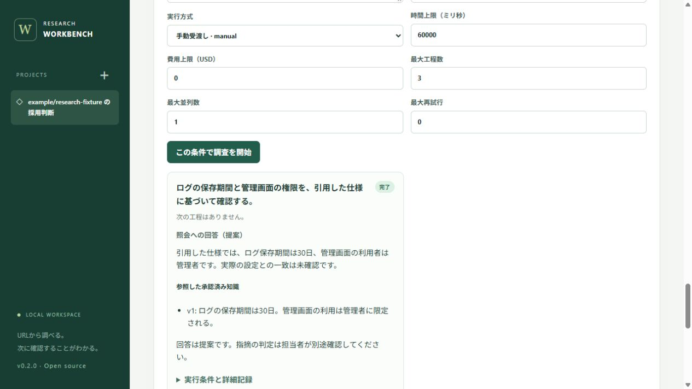

# Logos要件v3の実装・検証記録

対象: FR-17〜31 / LG-01〜15。実装前の基準コミットは`627efd5`。ローカル版の継続案件機能を対象とする。公開サイトのURL調査、既存プロジェクト機能も回帰対象に含める。

## 実装とレビュー

Luna 3担当が知識・判断domain、工程runnerとモデル接続、画面を分担した。実装後に担当を入れ替え、domain、runner、保存/API、画面を独立レビューした。統合・再起動試験、全体の品質ゲート、ブラウザー実操作は主担当で行った。

レビューで見つかり回帰テストへ固定した問題:

- 完了済みprovider工程の後で中断すると、再開後に応答照合へ進まない。
- 案件内の同時実行数、再開後の累積時間、停止と完了の競合が境界で守られない。
- 手動方式の把握できない費用を0として扱う。
- 修正版へ対象版を進められない、または過去の合格証跡だけで完了できる。
- 知識・基準の同じIDの旧revisionを、次の更新案の親として選ぶ。
- 非同期runの画面が更新されない、比較条件を変えても旧結果が残る。
- 任意の資料URLを空欄にすると保存できない。不正URLが検証エラーではなく500になる。

## 受入条件と証跡

| ケース | 確認した動作 | 証跡 |
|---|---|---|
| LG-01 | 案件・目的・資料分類・送信先・確認方法の境界、分類変更後の停止 | `workflow-domain.test.ts`、`workflow-api.test.ts`、`workflow-integration-review.test.ts` |
| LG-02 | SQLite再起動後のcheckpoint、完了工程の保持、条件変更時の別実行 | `workflow-api.test.ts`、`workflow-run-review.test.ts`、`workflow-runner.test.ts` |
| LG-03 | 観測と担当/理由/根拠付き人判断の分離 | `workflow-domain.test.ts`、`e2e/workflow-v3.spec.ts` |
| LG-04 | 基準案は旧版を置換せず、承認後に新版へ切替・関連判断失効 | `workflow-domain.test.ts`、`workflow-domain-review.test.ts`、`e2e/workflow-review.spec.ts` |
| LG-05 | 生観測を残す関連付け、抑止条件・期限・版・根拠の変更 | `workflow-domain.test.ts`、`e2e/workflow-v3.spec.ts` |
| LG-06 | 原文と引用、hash・revision・分類付き知識案 | `workflow-domain.test.ts`、`e2e/workflow-v3.spec.ts`、ブラウザー実操作 |
| LG-07 | 現行の承認済み知識だけを選択、出典版と不足/矛盾の記録 | `workflow-domain.test.ts`、`workflow-api.test.ts`、`e2e/workflow-v3.spec.ts` |
| LG-08 | 更新案と有効知識の分離、却下、v1→v2→v3の更新 | `workflow-domain.test.ts`、`e2e/workflow-v3.spec.ts`、`e2e/workflow-review.spec.ts` |
| LG-09 | 原文・対象版・基準の変更から判断・抑止・修正確認へ失効伝播 | `workflow-domain-review.test.ts`、`e2e/workflow-v3.spec.ts` |
| LG-10 | 手動・固定応答モデルの共通契約、不正応答・不達・設定差分 | `workflow-runner.test.ts`、`workflow-run-review.test.ts`。実モデルは未接続 |
| LG-11 | 同じ条件・正解集合のみの比較、費用・レビュー時間の欠測保持 | `workflow-api.test.ts`、`workflow-run-review.test.ts`、`e2e/workflow-v3.spec.ts` |
| LG-12 | 担当/計画/タスク/コミット/現行証拠、対象版変更後の再確認 | `workflow-domain-review.test.ts`、`e2e/workflow-review.spec.ts` |
| LG-13 | 方法・範囲ごとの最新確認、未実施/失敗/不能による完了拒否 | `workflow-domain.test.ts`、`e2e/workflow-v3.spec.ts` |
| LG-14 | 時間・工程・同時実行・再試行・費用上限、停止、shutdown | `workflow-runner.test.ts`、`workflow-run-review.test.ts`、`workflow-integration-review.test.ts` |
| LG-15 | URL結果→案件、元コミット/出典/原文保持、冪等取込と巻戻し | `workflow-api.test.ts`、`e2e/workflow-entry.spec.ts`、`e2e/workflow-v3.spec.ts` |

ファイル名は`tests/`を基点とする。E2Eは画面・HTTPのブラックボックス試験、runnerの回数・時計・接続制御は補助の単体/API試験。カバレッジ率を要求充足率として扱わない。

LG-01〜15に対応する上記試験は成功した。全ケースを人が手動実行した記録ではない。手動操作を行った範囲は次節に限定し、実モデルの接続・精度試験は含めない。

## ブラウザー実操作

利用者のDBと別の`.cache/manual-v3.db`、ポート4320、固定公開応答を用いた。URL調査から案件を作成し、製品仕様の原文を追加、引用付きの知識案を作成、担当と理由付きで承認、手動runにその知識を固定し、指定形式の合成応答を取り込んだ。runが完了しても、元の指摘候補は未確認のまま保たれることを確認した。外部モデルへ合成応答を要求した結果ではない。

## 品質ゲート

判定: **pass / ローカル版を利用可能**。Windows、Node.js v24.15.0、開始2026-10-04 06:43:06 UTC、終了06:44:12 UTC。新規ソースもGitの変更行計測へ含めて実行した。試験対象のファイル別SHA256は[run-identity.json](logos-v3-evidence/run-identity.json)、判定と分母・分子は[gate.json](logos-v3-evidence/gate.json)に保存した。

| 検証 | 結果 |
|---|---|
| 単体・API | 169件成功、失敗0件 |
| ローカル画面E2E | 33件成功、失敗・skip 0件 |
| 公開Pages E2E | 4件成功、失敗・skip 0件 |
| 合計 | 206件成功 |
| 行 / 文 / 関数 / 分岐 | 95.84% / 95.15% / 95.00% / 91.20% |
| 変更行 | 2,440 / 2,549、95.72%（既存基準コミットとの差分） |
| ファイル別 | 全ファイルで行90%以上・分岐85%以上 |
| 型検査・通常ビルド・Pagesビルド | 成功 |
| npm audit（製品依存） | 既知の脆弱性0件 |
| 過去証跡の保全 | frozen 123件、vulnerability 9件を検証 |

閾値・分母からの除外設定は変更していない。途中で画面2ファイルの分岐が不足したため、初回表示、根拠の未選択、比較条件変更、知識の連続改版などの試験を追加して再実行した。最終実行後にソースのハッシュが一致することを確認し、通常ビルドを作成した。ローカル版の保存DBを非公開の`.cache/backups/`へ退避してから更新・起動した。

通常ビルドのJavaScript bundleは約538 kB（gzip約158 kB）で、Viteの500 kB警告が残る。ビルド失敗ではないが、今後の画面分割時の改善対象とする。

## 検証の限界

- 実モデルの接続・応答精度・料金の実測、実業務での削減時間は未検証。アダプターは固定応答とHTTP契約で検証する。モデル未設定でも手動方式で動作する。
- 外部接続の許可設定と公開情報の分類は利用者が決める。分類を自動推定して機密情報を公開扱いにしない。
- 基準の機械的な適用条件は案件の目的と明示対象版。自由文の意味上の適合は人が確認する。矛盾検知も完全な自然言語の真偽判定ではなく、表示された出典を人が評価する。
- 通常機能・回帰試験は管理環境で利用者が実施し、その方法と証跡を記録する。本アプリは任意コマンド、攻撃再現、修正ワーカーを実行しない。
- 公開Pages版はURL調査の入口。継続案件・SQLite・モデル接続はローカル版の機能。
